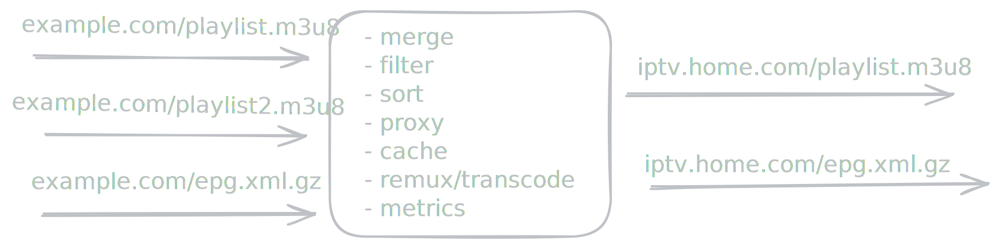

---
hide:
  - navigation
  - toc
---

# Majmun

  
  

    <strong>A minimal, functional IPTV gateway for your home TVs.</strong> 
    Transform and proxy your M3U playlists, EPG, and video streams through a single entry point.
    Configure playlists exactly how each client needs them, declaratively.
  

---

### :material-playlist-music: Features

* Use multiple stream sources
* Transform channels: add or remove fields, set values using the full power of Go templates
* Transform playlists: filter, sort, merge, or remove duplicates
* Configure proxies and limits at global, playlist, or client level
* Demultiplex single streams to multiple TVs
* Generate custom errors for limits, stream failures, and expired links
* Proxy and cache all connections to 3rd party services, cache with configurable retention to all static assets

Majmun acts as a lightweight wrapper over FFmpeg (or other stream processors).

Everything operates statelessly with a single component - no database required. Clients receive a personal encrypted link with channel properties and a TTL, allowing them to access Majmun regardless of any server-side changes or playlist's transform.

---

Why **Majmun**? It means 🐒 in Balkan languages. It's just for fun and to avoid interfering with other apps